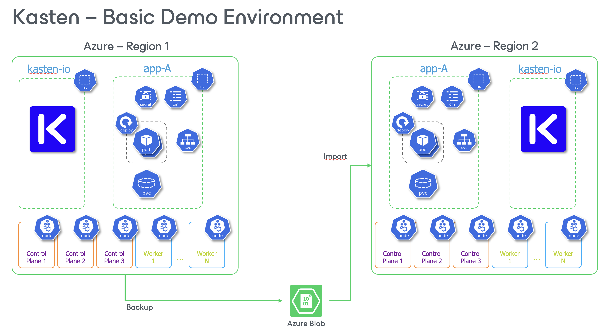
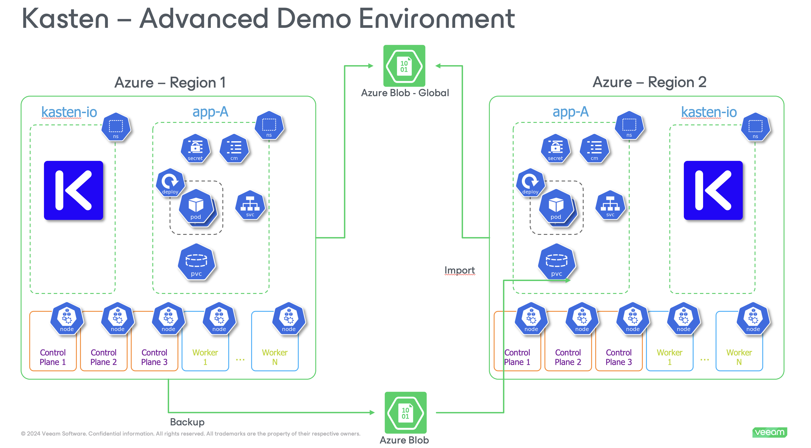
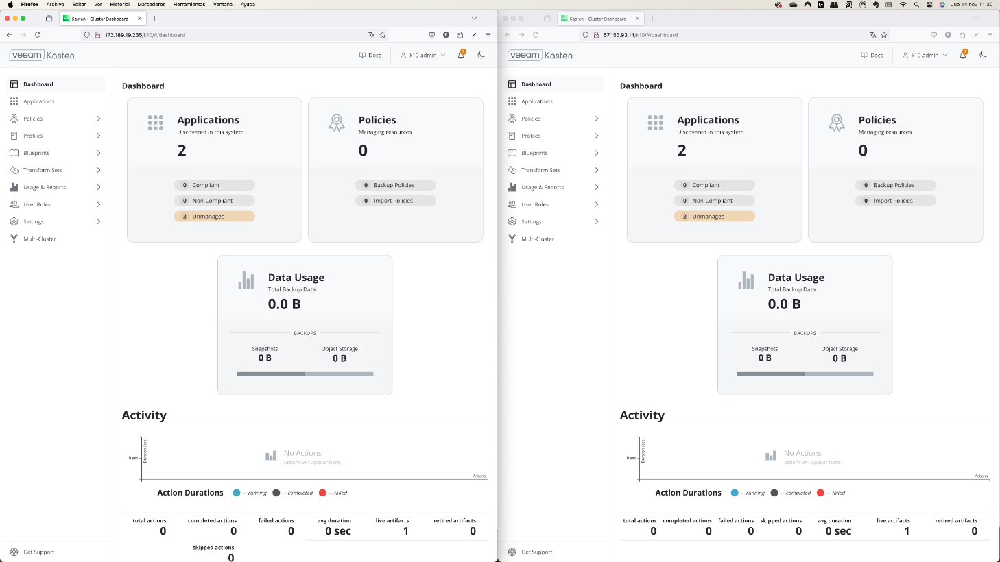
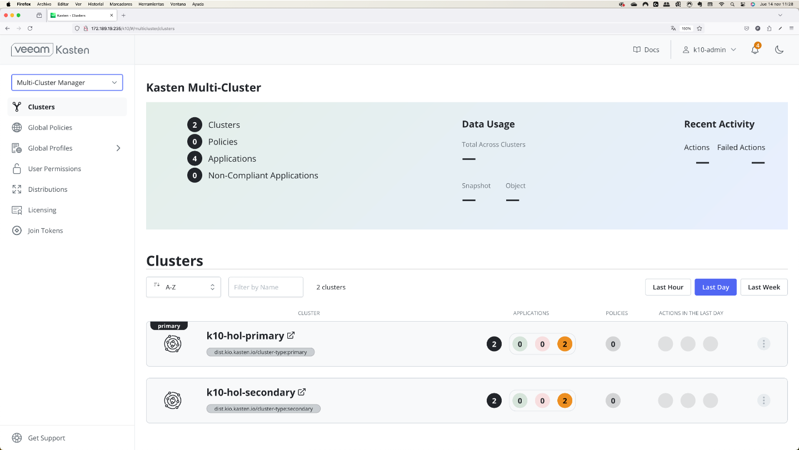

# Terraform-K10-Demos-AKS

***Status:** Work-in-progress. Please create issues or pull requests if you have ideas for improvement.*

# **Fully automated deploy of Azure AKS Cluster with Kasten**
Example of using Terraform to automate the deploy of an Azure AKS cluster, plus the installation and initial Kasten K10 configuration 


## Summary
This projects demostrates the process of deploying an Azure AKS cluster, plus installing and configurig Kasten K10 using Terraform for fully automation of this process.  The resources to be created include:
* VNET Resources
* 2 AKS Clusters in different AZs (Potentially you could set it to run in different regions)
    - StorageClass
    - Volume Snapshot Class
* Azure Blob
* Kasten
    - Basic Authentication
    - Access via LoadBalancer
    - EULA agreement
    - Location Profile creation using Azure Blob
    - Policy preset samples creation
    - TransformSets
* 2 x Demo Apps
* All components with Azure tags

	

An advanced optional configuration is included, which add the following features to Kasten configuration
* Multi-Cluster configuration
* Kanister Blueprints
* Blueprint Bindings

	

All the automation is done using Terraform and leveraging the Azure, Kubernetes, and [Kasten K10](https://docs.kasten.io/latest/api/cli.html) APIs.

## Disclaimer
This project is an example of an deployment and meant to be used for testing and learning purposes only. Do not use in production. 


# Table of Contents

1. [Prerequisites](#Prerequisites)
2. [Installing AKS Cluster and Kasten](#Installing-AKS-Cluster-and-Kasten)
3. [Using the Azure AKS cluster and Kasten](#Using-the-Azure-AKS-cluster-and-Kasten)
4. [Destroying the AKS Cluster](#Destroying-the-AKS-Cluster)


## Prerequisites
To run this project you need to have some software installed and configured: 
1. [Terraform](https://developer.hashicorp.com/terraform/tutorials/Azure-get-started/install-cli)
Ej. using brew for macOS

```
brew tap hashicorp/tap
brew install hashicorp/tap/terraform
```

2. [Kubectl](https://kubernetes.io/docs/tasks/tools/#kubectl)
Ej. using brew for macOS

```
brew install kubectl
```

3. [Install Azure CLI](https://learn.microsoft.com/en-us/cli/azure/install-azure-cli)
Ej. using brew for macOS
```
brew install azure-cli
```

4. Configure Azure CLI providing credentials with enough privileges to create resources in Azure.
```
az login 
```

5. Download all terraform files and keep them locally, all in the same folder in your laptop :


## Installing AKS Cluster and Basic Kasten Configuration
For Terraform to work, we need to provide certain information to be used as variables in the **terraform.tfvars** file.   


| Name                    | Type     | Default value       | Description                                                    |
| ----------------------- | -------- | ------------------- | -------------------------------------------------------------- |
| `region01`              | String   | `francecentral`     | Azure Region where all resources will be created                 |
| `region02`              | String   | `westeurope`        | Azure Region where all resources will be created                 |
| `cluster_name01 `       | String   | `k10cluster1`       | Name of the cluster to be created.  All Azure resources will use the same name  |
| `cluster_name02 `       | String   | `k10cluster2`       | Name of the cluster to be created.  All Azure resources will use the same name  |
| `aks_instance_type`     | String   | `Standard_D2ds_v4`  | Specify the AKS nodes instance type  |
| `aks_num_nodes`         | Number   | `3`                 | Number of AKS Worker nodes to be created  |
| `aks_vnet_cidr_ipv4`    | String   | `10.50.0.0/16`      | CIDR block for the new VNET where the AKS cluster will be deployed  |
| `aks_subnet_cidr_ipv4`  | String   | `10.50.1.0/24`      | CIDR block for the subnet inside the VNET where the AKS cluster will be deployed  |
| `owner_aks`             | String   | `owner@domain.com`  | Owner tag in Azure            |
| `activity`              | String   | `demo`              | Activity tag in Azure         |
| `admin_password`        | String   | `Veeam123!`         | Password for Kasten admin user          |


### Building the AKS Cluster with Kasten
Once the variables are set, the only thing we need to do is to apply the Terraform files:
- By using a terminal, go to the folder containing all terraform files.
- Run the following commands
```
terraform -chdir=basic init
terraform -chdir=basic apply
```

### Using the Azure AKS cluster and Kasten
Once Terraform is done building the infrastructure and installing Kasten, you will get the following information:

| Name                    | Value       | Description                                                    |
| ----------------------- | ----------- | -------------------------------------------------------------- |
| `aks_cluster_name_01  `        | `hol-k10cluster1-1735916477`         | Name of the Azure AKS cluster in Region01 created, with a random number to prevent conflicts               |
| `aks_cluster_name_02  `        | `hol-k10cluster2-1735916477`         | Name of the Azure AKS cluster in Region02 created, with a random number to prevent conflicts               |
| `app_k10app_url`           | `http://34.142.124.14`              | URL to access the demo Stock app        |
| `app_pacman_url`           | `http://34.142.124.15`              | URL to access the demo Pacman app        |
| `k10_password `               | `Veeam123!/`    | Password for Kasten admin user |
| `k10_username `               | `admin`    | Kasten admin username  |
| `k10url_aks01 `               | `http://34.147.149.221/k10/`    | URL to access the Kasten K10 Dashboard in Cluster01  |
| `k10url_aks02 `               | `http://34.147.149.222/k10/`    | URL to access the Kasten K10 Dashboard in Cluster02  |
| `kubeconfig_aks01`            | `az aks get-credentials --resource-group rg-k10cluster1-1735916477 --name hol-k10cluster1-1735916477 --context k10-hol-primary` | Command to configure the kubeconfig file and access the kubernetes cluster01 with kubectl  |
| `kubeconfig_aks02`            | `az aks get-credentials --resource-group rg-k10cluster2-1735916477 --name hol-k10cluster2-1735916477 --context k10-hol-secondary` | Command to configure the kubeconfig file and access the kubernetes cluster02 with kubectl  |

At this point, it's possible to run tests to backup and restore the demo App, creating policies.

	


### Destroying the AKS Cluster with Kasten
Once you are done using the AKS cluster, you can destroy it alonside all other resources created with Terraform, by using the following command:
```
terraform -chdir=basic destroy
```

## Advanced Kasten configuration
The only thing we need to do is to apply the Terraform files:
- By using a terminal, go to the folder containing all terraform files and folders.
- Run the following commands
```
terraform -chdir=advanced init
terraform -chdir=advanced apply
```
### Using the AKS Cluster and Kasten
Once Terraform is done configuring additional Kasten features, you will get the following information:

| Name                    | Value       | Description                                                    |
| ----------------------- | ----------- | -------------------------------------------------------------- |
| `az_bucket_name_global` | `globalblob1735916477`     | Name of the Azure Blob to be used as Global Location Profile               |
| `az_bucket_key_global`  | `Storege Key`              | Blob Storage Key for the Azure Blob        |


Now it's also possible to use Kanister for consistent backups of the PostgreSQL database, and also demo the Multi-Cluster feature with Global Location Profiles and Global Policies.

	